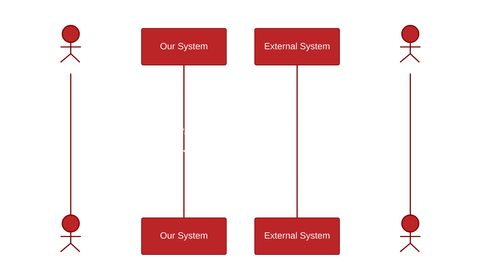

The documentation for sequence diagram messages is located at [mermaid-js/messages](https://mermaid.js.org/syntax/sequenceDiagram.html#messages)

How actors interact? Take the first requirement `A User created a new object: I need to mint a ID with ID System X`

1. User Creates a thingamajig in our system
   ```
   user ->> sys: ...
   ```
1. Our System asks System X to mint an ID
1. System X responds with the ID
1. We show the user the ID



